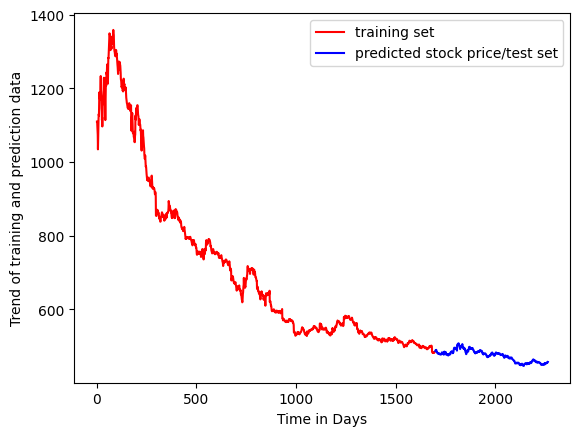

# Stock-Price-Prediction-Using-TSA-and-LSTM
This is a Stock Price Prediction Notebook using Time Series Analysis(ARIMA) and LSTM.

## Contents
The flow of the Notebook is as follows:
  1. Data Exporation and visualization using Matplotlib
  2. Feature Engineering where we select the most important features with respect to the given dataset.
  3. Time Series Analysis(TSA) using ARIMA where we visualised the graph by creating rolling windows of desired shape and Bollinger Bands.
  4. Finding important features using XGBoost and training the data. Even with precise finetuning and modeling we see that the error is not that low.
  5. Passing the dataset through an LSTM model to see how it performs. It is seen that it outperforms the ARIMA model by a huge margin. This reiterates the fact that Neural Network generally does better than classical ML algorithms.
  6. We end the notebook with a conclusion how things can be improved by the use of more advanced methods.

## How to see the project
- Clone the repository in your local machine(or Google Colab)
- The dataset is taken from Yahoo API and saved in the `Amazon.csv` file. The closing values are given in the `Close.csv` file.
- The requirements and dependencies are given in `requirements.txt`. Use `pip install -r requirements.txt` to install the packages and use it.
- Run the notebook in Jupyter or Colab and see the results.

## Prediction:

## Contributors
Avik Das @kivaissad

## License
This project is licensed under the MIT License - see the LICENSE file for details.
